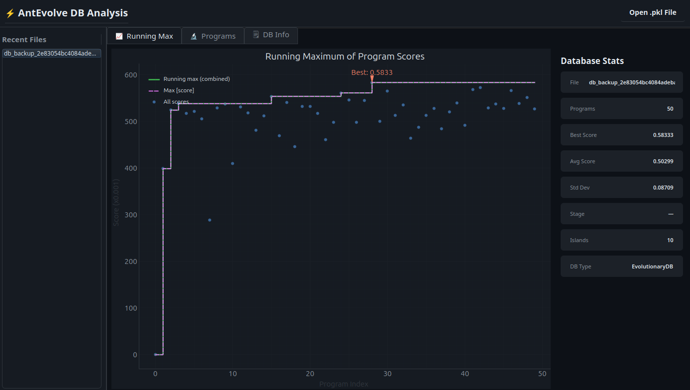

## AntEvolve - exploring link prediction algorithms via program evolution

Complementary code for the paper: AntEvolve: Exploring Link Prediction Algorithms via Program Evolution.



Requirements:
 -  Docker
 -  virtualenv or any virtual env for Python is recommended.
 -  Computer with > 4 cpus and >16Gb of Ram.

### How to run

```
virtualenv -p python3 .venv
source .venv/bin/activate
pip install .
pip install -r requirements.txt
```

### Adjust number of workers

Each worker uses 2 cpus by default, so adjust number of workers
in `2_run_local_workers.sh` script for your machine.

### Start all services

```
./1_build_local_worker.sh
./2_run_local_workers.sh
./3_run_local_controller.sh
```

### Start the experiment

```
./4_run_experiment.sh
```

### Check logs

```
./6_worker_logs.sh
./5_controller_logs.sh
```

### Extract the best program

```
./8_extract_best.sh
```

### View the evolution in a GUI

```
pip install PyQt6 pyqtgraph

./9_analyse_database.sh
```

### Stop all

```
./7_stop_local_service.sh
```

### Clean all

```
./clean.sh
```